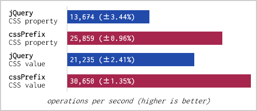

# CSSPrefix

[](https://www.npmjs.com/package/cssprefix) [](https://github.com/anseki/cssprefix/issues) [](package.json) [](LICENSE-MIT)

CSS Prefixer for JavaScript code.

The simple library to get vendor-prefixed name (e.g. `webkitFlex`) and vendor-prefixed value (e.g. `-moz-inline-grid`) of CSS property.  
This is not pre-compiler for style-sheet, this is used to handle those in JavaScript code.

## Usage

Load CSSPrefix into your web page.

```html
<script src="cssprefix.min.js"></script>
```

## Methods

### `CSSPrefix.getName`

```js
prefixedName = CSSPrefix.getName(name)
```

Return a vendor-prefixed name of CSS property, or an original name that doesn't require vendor-prefix. If nothing was found, return an `undefined`.

For example:

```js
prefixedName = CSSPrefix.getName('text-emphasis'); // 'textEmphasis' also is accepted
console.log(prefixedName);
// -> "webkitTextEmphasis" on Chrome
// -> "textEmphasis" on Firefox

prefixedName = CSSPrefix.getName('column-count'); // 'columnCount' also is accepted
console.log(prefixedName);
// -> "columnCount" on Chrome
// -> "MozColumnCount" on Firefox
```

### `CSSPrefix.getValue`

```js
prefixedValue = CSSPrefix.getValue(name, value)
```

Return a vendor-prefixed value of CSS property, or an original value that doesn't require vendor-prefix. If `value` is an Array that includes multiple values, try it with each value until any one of them is found. If nothing was found, return an `undefined`.  
`name` can be an original name even if it requires vendor-prefix.

For example:

```js
prefixedValue = CSSPrefix.getValue('cursor', 'grab');
console.log(prefixedValue);
// -> "-webkit-grab" on Chrome
// -> "grab" on Firefox

prefixedValue = CSSPrefix.getValue('display', ['inline-grid', 'block']);
console.log(prefixedValue);
// -> "block" on Chrome
// -> "-moz-inline-grid" on Firefox
```

## Differences from jQuery

jQuery also can find the vendor-prefixed name. But it can't find the vendor-prefixed **value**. And your code can't get the vendor-prefixed name that jQuery found.  
And jQuery doesn't have cache. That affects performance.



*This is older version.*

Reported by [Benchmark.js](http://benchmarkjs.com/).  
Test Code:

```js
var elmJq = $('#elm4jquery'),
  elmCp = document.getElementById('elm4cssprefix');

// jQuery name
function jqName() {
  elmJq.css('column-width', '5px');
  elmJq.css('column-width', '10px');
}

// CSSPrefix name
function cpName() {
  elmCp.style[CSSPrefix.getName('column-width')] = '5px';
  elmCp.style[CSSPrefix.getName('column-width')] = '10px';
}

// jQuery value
function jqValue() {
  // jQuery can't find vendor-prefixed value.
  elmJq.css('cursor', 'grab,-webkit-grab');
  elmJq.css('cursor', 'grabbing,-webkit-grabbing');
}

// CSSPrefix value
function cpValue() {
  elmCp.style[CSSPrefix.getName('cursor')] = CSSPrefix.getValue('cursor', 'grab');
  elmCp.style[CSSPrefix.getName('cursor')] = CSSPrefix.getValue('cursor', 'grabbing');
}
```

## Breaking Changes

### v2.0

- `CSSPrefix.getProp` and `CSSPrefix.setValue` were removed, then `CSSPrefix.getName` and `CSSPrefix.getValue` were added. The `CSSPrefix.getValue` doesn't set a value.
- Both `CSSPrefix.getName` and `CSSPrefix.getValue` don't require an element.
- Both `CSSPrefix.getName` and `CSSPrefix.getValue` return `undefined` if nothing was found. Older methods returned an empty string but some CSS properties accept empty string, and that couldn't differentiate "accepted empty string" and "value not found".

### v1.0

- Since v1.0, the repository name and its package name were unified, and the `css-prefix.min.js` file also was renamed to `cssprefix.min.js`.
